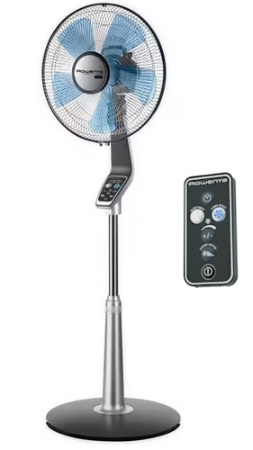
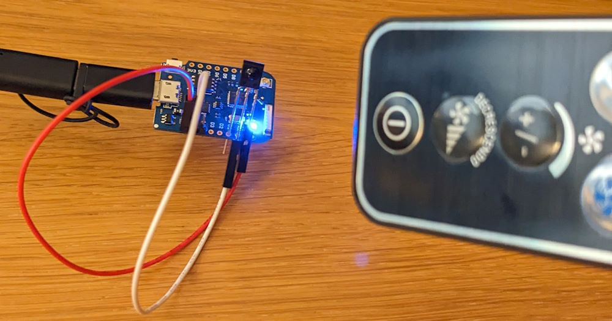
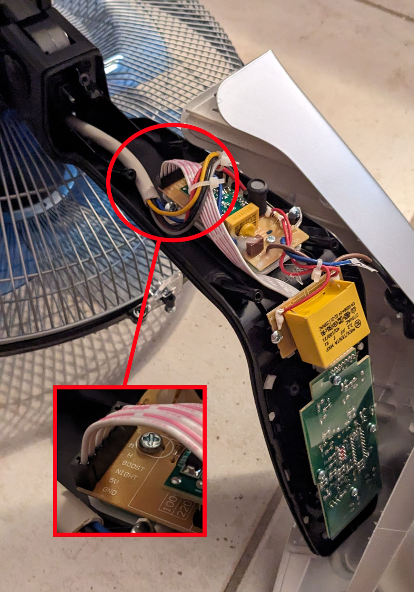
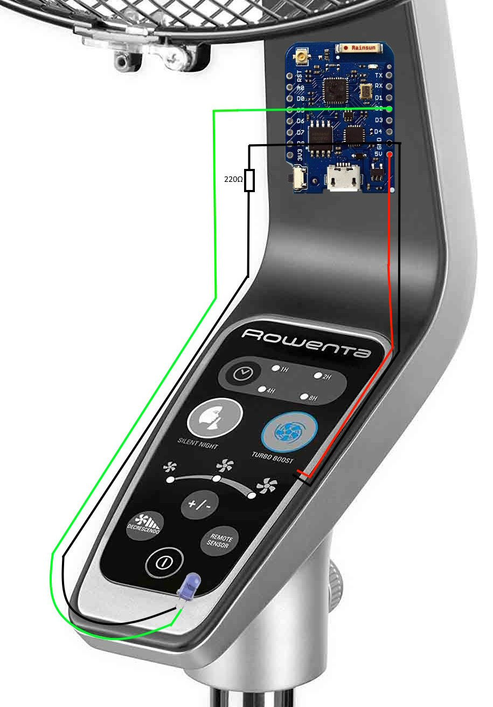

# arduino-wifi-fan
An arduino project to add wifi to an infrared fan (base on wemos d1)


I got a rowenta VU5670F2, it’s a silent fan with a basic IR remote. I wanted to add wifi to control it from a web interface.





> **Warning**
> 
> Do it at your own risk
> 
> I am not responsible for any broken board or fan


Used :
-	WEMOS D1
-	IR LED
-	220ohm resistor
-	IR receptor to get the code.


<br/>
1 – Get the IR code of each button from the IR remote with this arduino example :
https://github.com/crankyoldgit/IRremoteESP8266/blob/master/examples/IRrecvDumpV3/IRrecvDumpV3.ino



It gives me the protocol « Symphony » with these codes :


| Button | Code |
| ------------- | ------------- |
| time  | 0xD88  |
| silent night  | 0xDCC  |
| turbo boost  | 0xDA0  |
| +/-  | 0xD82  |
| decrescendo  | 0xD84  |
| on/off  | 0xD81  |

<br/>
2 – My working code :

[IR_send_codeWIFI.ino](IR_send_codeWIFI.ino)

Change your Wifi name and password  :

line 90 ```WiFi.begin("___WIFI_NAME___", "___WIFI_PASSWORD___");```


<br/>
<br/>
3 – Get the ESP IP address and try it before continue.


Use a link to turn it on :

http://ESP.LOCAL.IP.ADDRESS/send_onoff


The other buttons :

http://ESP.LOCAL.IP.ADDRESS/send_time

http://ESP.LOCAL.IP.ADDRESS/send_silent_night

http://ESP.LOCAL.IP.ADDRESS/send_turbo_boost

http://ESP.LOCAL.IP.ADDRESS/send_more_less

http://ESP.LOCAL.IP.ADDRESS/send_decrescendo


> **Note**
> 
> Think about doing an IP reservation on your router, and it will never change.


<br/>
<br/>
5 – Open the fan, and find a way to insert the board + IR LED




5v and GND are easy to find.
Here is how I did it in mine :




> **Note**
> 
> Put the IR LED close and toward the IR receptor.
>
>I used heat shrink tube to isolate the LED near the main board.


